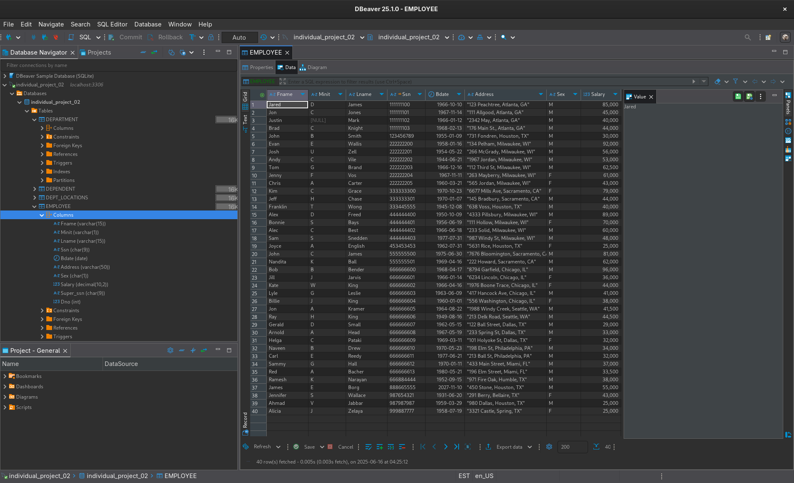
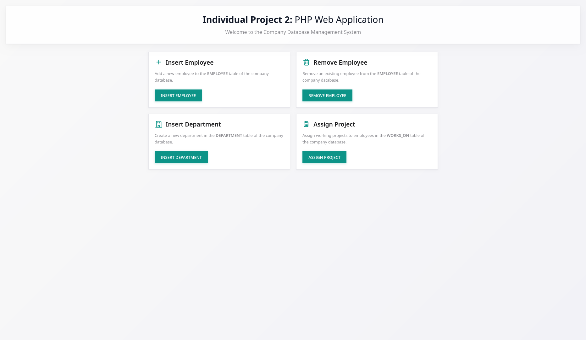
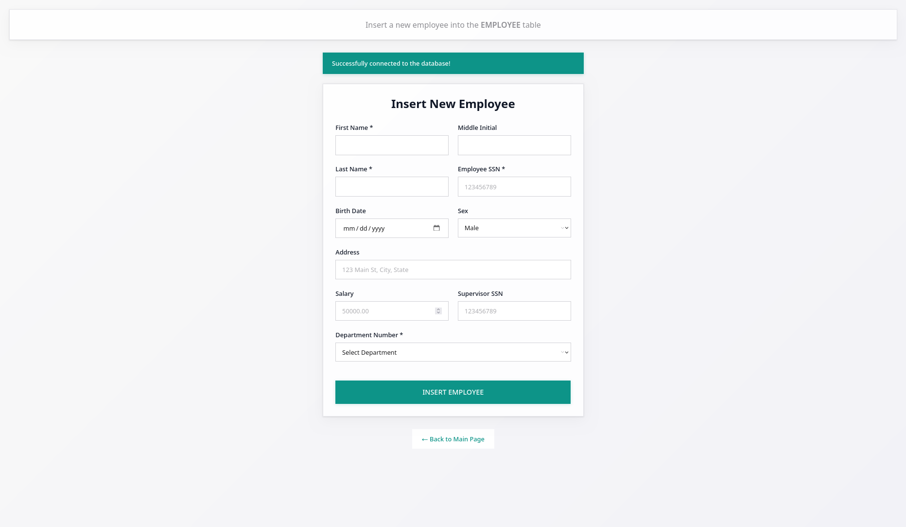
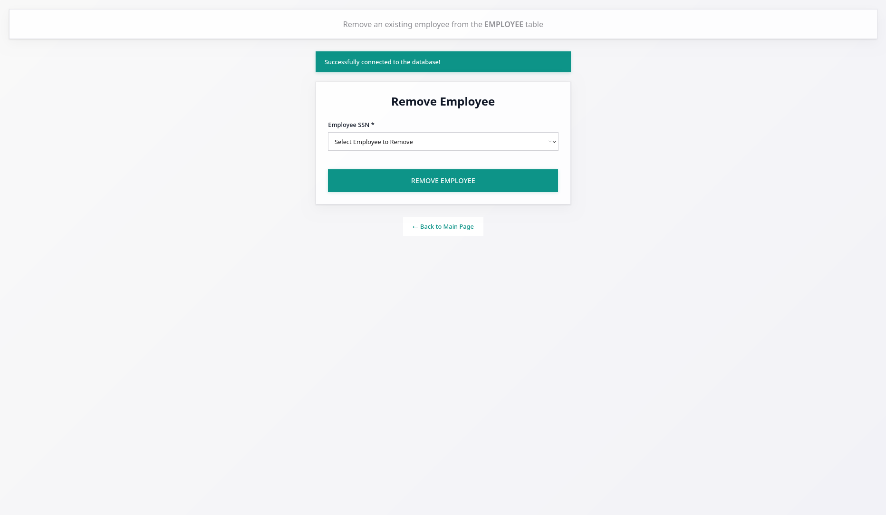
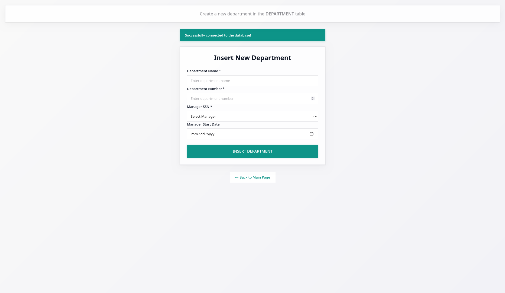

# PHP Company Database Management System

A web-based PHP application for managing a company database with employee, department, and project management functionality.

## Features

- **Employee Management**
  - Insert new employees into the database.
  - Remove existing employees from the database.

- **Department Management**
  - Create new departments in the company database.

- **Project Management**
  - Assign projects to employees.
  - Track employee work assignments.

## Database Schema

The application uses a MySQL database with the following tables:

- **EMPLOYEE** - Stores employee information (name, SSN, salary, etc.).
- **DEPARTMENT** - Contains department details and management information.
- **DEPT_LOCATIONS** - Tracks department locations.
- **PROJECT** - Manages project information and assignments.
- **WORKS_ON** - Links employees to their assigned projects.
- **DEPENDENT** - Stores employee dependent information.

## Screenshots

### Database Schema

### Application Interface

